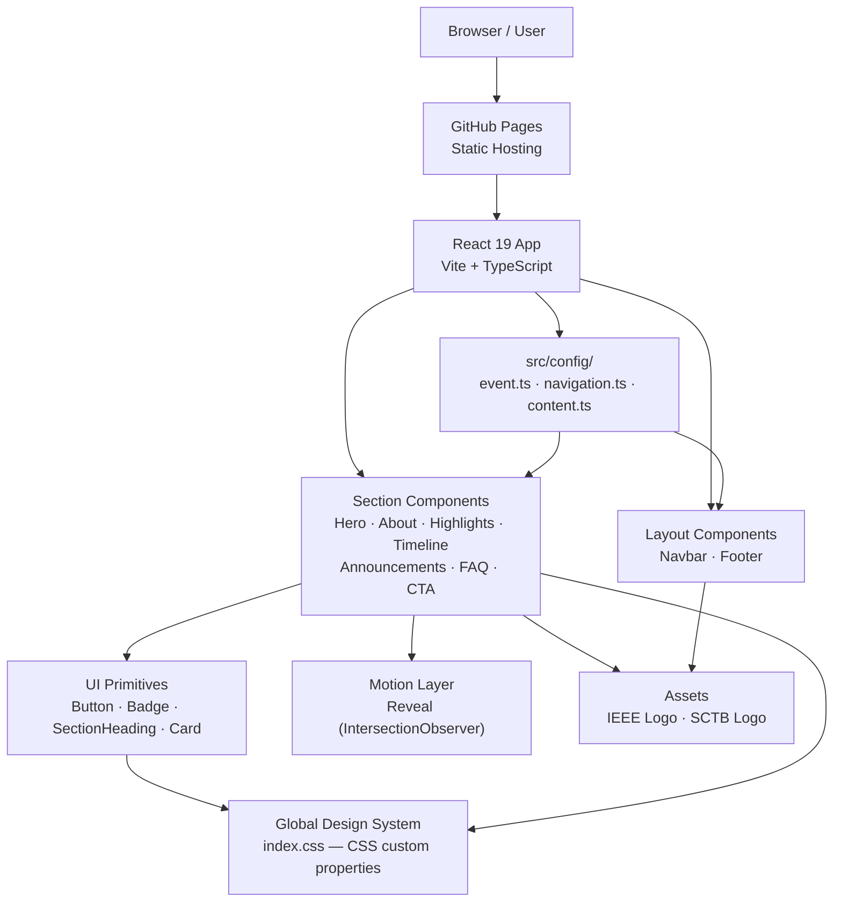
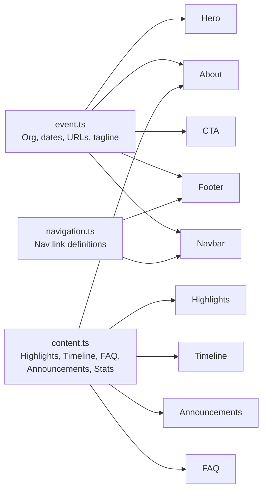
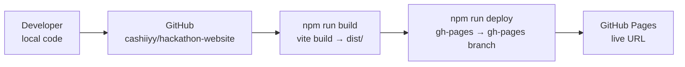

# Architecture — Dhyuthi 7.0

## System Architecture



---

## Data Flow



---

## Deployment Architecture



---

## Key Architectural Decisions

### 1. Static Single-Page Application

The website is a fully static SPA. There is no backend server, no API, and no database. All content is bundled at build time from TypeScript config files.

**Why**: Pre-event landing pages don't require dynamic data. Static hosting on GitHub Pages is free, fast, and globally distributed via CDN.

### 2. Content–Presentation Separation

All event-specific text, dates, and links live in `src/config/`. Components receive this data as imports — they never hardcode event content.

**Why**: This makes the codebase reusable. To create Dhyuthi 8.0, only the config files need to change.

### 3. CSS Custom Properties (not Tailwind, not CSS Modules)

The design system is implemented as a single `index.css` file with CSS custom properties. Components use scoped CSS files that reference the global tokens.

**Why**: Maximum control. No build-time class generation overhead. Easier to understand by any team member, not just Tailwind users.

### 4. No State Management Library

The only React state used is:
- `useState` in `Navbar` (scroll state, menu open state)
- `useState` in `FAQ` (which item is open)
- `useState` in `Hero` (mounted flag for entrance animation)

No Redux, no Zustand, no Context API needed. The app is content-driven, not interactive.

---

## File Structure

```
k:/PROJECTS/Dhyuthi/
│
├── src/
│   ├── App.tsx                    # Root component — assembles all sections
│   ├── main.tsx                   # Entry point
│   ├── index.css                  # Global design token system
│   │
│   ├── config/
│   │   ├── event.ts               # All event metadata
│   │   ├── navigation.ts          # Nav link definitions
│   │   └── content.ts             # Section content arrays
│   │
│   ├── assets/
│   │   ├── ieee-logo-white.png    # Official IEEE logo (white)
│   │   ├── ieee-logo-black.png    # Official IEEE logo (black)
│   │   ├── sctb-logo-white.png    # IEEE SCT SB logo (white)
│   │   └── sctb-logo-black.png    # IEEE SCT SB logo (black)
│   │
│   └── components/
│       ├── layout/
│       │   ├── Navbar/
│       │   └── Footer/
│       ├── ui/
│       │   ├── Button/
│       │   ├── Badge/
│       │   └── SectionHeading/
│       ├── sections/
│       │   ├── Hero/
│       │   ├── About/
│       │   ├── Highlights/
│       │   ├── Timeline/
│       │   ├── Announcements/
│       │   ├── FAQ/
│       │   └── CTA/
│       └── motion/
│           └── Reveal.tsx
│
├── public/
│   └── favicon.png                # IEEE logo as favicon
│
├── img/                           # Original logo assets from IEEE
│   ├── IEEE Logo_tag White 1.png
│   ├── IEEE Logo_tag Black(1) 1.png
│   ├── SB_White 1.png
│   └── SB_Black 1.png
│
├── Doc/                           # Project documentation
│
├── index.html                     # App entry HTML with SEO meta
├── vite.config.ts
├── tsconfig.json
├── tsconfig.node.json
├── package.json
└── eslint.config.js
```
