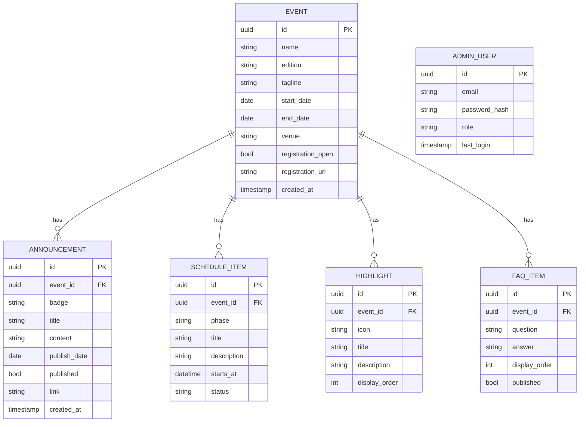
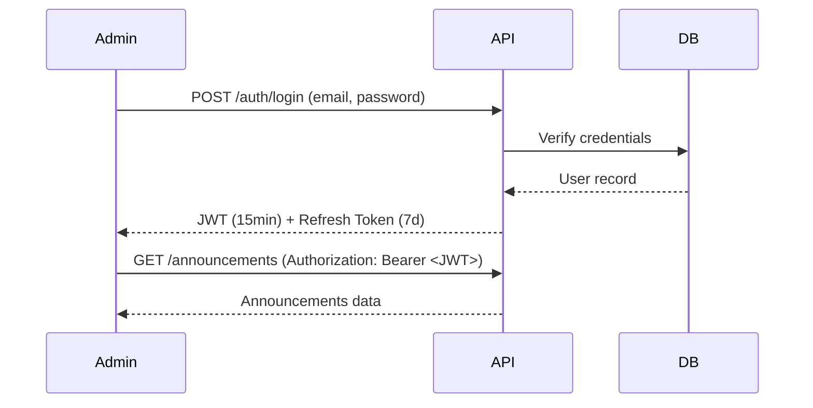

# Backend Architecture — Dhyuthi 7.0

> ⚠️ **This is a PROPOSED / FUTURE architecture only.**
> No backend has been implemented. This document describes what a backend system could look like if the website needed dynamic content management.

---

## Why No Backend Now?

The current Dhyuthi 7.0 website is intentionally static. Content is managed through `src/config/content.ts`. This is appropriate because:

1. Content updates are infrequent (pre-event announcements, post-event results)
2. A static site is faster, cheaper, and more reliable than a server-backed site
3. The IEEE SB team can update content by editing a TypeScript file and redeploying

A backend would be warranted if:
- There are dozens of announcements updated daily
- An admin team needs a UI to manage content without touching code
- Registration needs to be handled directly (not delegated to an external form)
- Real-time features (live schedule updates, winner announcements) are needed

---

## Proposed Data Model



---

## Proposed API

### Base URL
```
https://api.dhyuthi.ieeesctb.in/api/v1
```

### Public Endpoints (no auth)

| Method | Endpoint | Description |
|---|---|---|
| `GET` | `/events/current` | Current active event metadata |
| `GET` | `/events/:id` | Specific event by ID |
| `GET` | `/announcements` | All published announcements for current event |
| `GET` | `/schedule` | Event schedule items |
| `GET` | `/highlights` | Event highlight cards |
| `GET` | `/faqs` | Published FAQ items |

### Admin Endpoints (JWT required)

| Method | Endpoint | Description |
|---|---|---|
| `POST` | `/auth/login` | Admin login → JWT |
| `POST` | `/announcements` | Create announcement |
| `PUT` | `/announcements/:id` | Update announcement |
| `DELETE` | `/announcements/:id` | Delete announcement |
| `POST` | `/schedule` | Add schedule item |
| `PUT` | `/events/:id` | Update event metadata |

---

## Proposed Stack

| Layer | Technology | Reason |
|---|---|---|
| API server | Node.js + Express or Fastify | Familiar to student developers |
| Database | PostgreSQL | Relational, type-safe with TypeORM/Prisma |
| ORM | Prisma | TypeScript-native, excellent DX |
| Auth | JWT (short-lived) + refresh tokens | Stateless, suitable for admin-only |
| Object storage | Supabase Storage or AWS S3 | For poster images, teaser graphics |
| Hosting | Railway or Render (backend), Vercel (frontend) | Free tier suitable for student events |
| CDN | Cloudflare | Free, handles DDoS for public events |

---

## Authentication Design



Admin roles: `SUPERADMIN`, `EDITOR`
- `SUPERADMIN`: Full CRUD on all entities
- `EDITOR`: Create/edit announcements and FAQ only

---

## Security Considerations

| Concern | Mitigation |
|---|---|
| SQL injection | Prisma ORM parameterized queries |
| XSS | React escapes JSX by default; sanitize markdown if used |
| CSRF | JWT in Authorization header (not cookies) avoids CSRF |
| Rate limiting | `express-rate-limit`: 100 req/15min for public, 20 req/15min for auth |
| CORS | Whitelist only the production frontend domain |
| Secrets | Environment variables via `.env`, never committed to Git |
| File uploads | Validate MIME type and size; store in object storage, never filesystem |
| Password storage | bcrypt (cost factor 12) |

---

## Frontend Integration (Future)

When a backend is added, replace config file imports with API calls:

```typescript
// Current: static config
import { announcements } from "@/config/content";

// Future: API call
const { data: announcements } = useSWR("/api/v1/announcements", fetcher);
```

The component layer does not need to change — only the data source changes.
