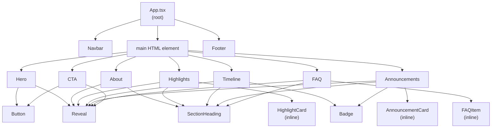

# Component Architecture — Dhyuthi 7.0

## Component Hierarchy



---

## Component Layers

### Layer 1: Pages (App.tsx)

A single page. `App.tsx` assembles all sections in order. No routing.

**Responsibility**: Section ordering, global layout structure.

### Layer 2: Layout (`components/layout/`)

| Component | Responsibility |
|---|---|
| `Navbar` | Persistent navigation. Scroll-aware. Mobile hamburger drawer. Active section tracking via IntersectionObserver. |
| `Footer` | Branding, navigation, social links, copyright. |

Layout components are always visible and frame the content. They consume `event.ts` and `navigation.ts` directly.

### Layer 3: Sections (`components/sections/`)

| Section | ID | Responsibility |
|---|---|---|
| `Hero` | — | First impression. Event identity lockup. CTAs. |
| `About` | `#about` | Event description. Key facts panel. Organization context. |
| `Highlights` | `#highlights` | What makes Dhyuthi unique. 4-card grid. |
| `Timeline` | `#timeline` | Event phase timeline. Data-driven, all TBA-friendly. |
| `Announcements` | `#announcements` | Pre-event content. Conditionally rendered (hidden if array is empty). |
| `FAQ` | `#faq` | Accordion FAQ. Keyboard accessible. |
| `CTA` | `#register` | Final registration push. Adapts based on `registrationOpen` flag. |

All sections:
- Are semantically wrapped in `<section>` with `id` and `aria-labelledby`
- Use `SectionHeading` for consistent titling
- Use `Reveal` for scroll animation
- Source content from `src/config/content.ts` or `src/config/event.ts`

### Layer 4: UI Primitives (`components/ui/`)

| Component | Props | Usage |
|---|---|---|
| `Button` | `variant`, `size`, `href`, `onClick`, `disabled`, `external` | All CTA buttons. Renders as `<a>` when `href` is set. |
| `Badge` | `variant` | Status labels on announcements and timeline. |
| `SectionHeading` | `label`, `title`, `subtitle`, `align` | Section titles with consistent structure. |

Primitives have no content knowledge. They receive everything via props.

### Layer 5: Motion (`components/motion/`)

| Component | Props | Usage |
|---|---|---|
| `Reveal` | `delay` (0–5), `threshold`, `className` | Wraps any element to apply scroll-triggered entrance animation. |

`Reveal` uses `IntersectionObserver`. It fires once (on first intersection) and disconnects. The animation is controlled entirely by CSS classes (`reveal` + `revealed`).

---

## Reusability Design

### For Dhyuthi 8.0

1. Update `src/config/event.ts` — change edition, dates, tagline, registration URL
2. Update `src/config/content.ts` — update highlights, timeline items, FAQ, announcements
3. No component changes required

### For Another IEEE Event (e.g., Pradhanya, a hackathon)

1. Replace `src/assets/` logos with new event logos
2. Update `src/config/event.ts` with new event identity
3. Update `src/config/content.ts` with new section content
4. Optionally update `--color-primary` and `--color-accent` in `index.css` for a different brand color
5. The entire component library reuses without changes

### Design Token Customization

To adapt the visual identity for another event:
```css
:root {
  --color-primary: #YOUR_COLOR;
  --color-accent:  #YOUR_ACCENT;
}
```
All components inherit from these tokens. One change affects the entire site.

---

## Naming Conventions

- **Files**: PascalCase for components (`Navbar.tsx`), camelCase for configs (`event.ts`)
- **CSS classes**: BEM-inspired (`navbar__brand`, `hero__title-char`)
- **TypeScript interfaces**: PascalCase, exported from config files
- **Component props**: camelCase
- **CSS custom properties**: `--color-*`, `--space-*`, `--font-*`, `--radius-*`
